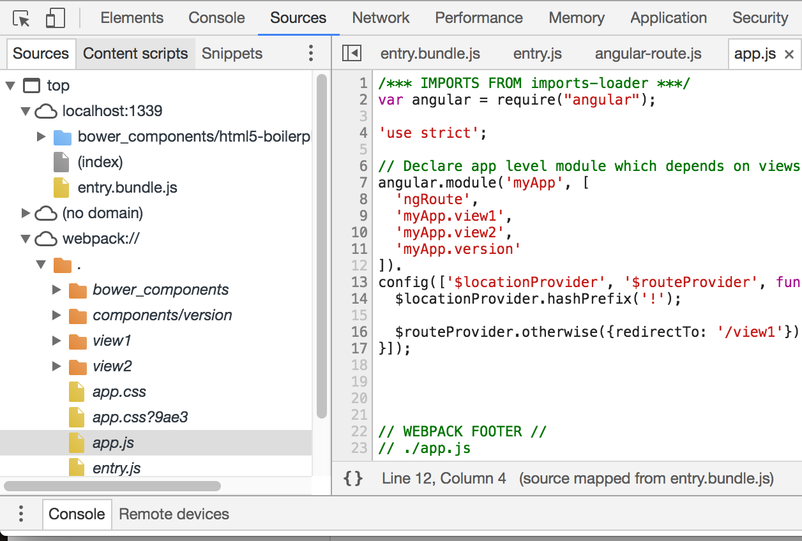

<!-- $theme: default -->

Angular + webpack
===

如何使用 webpack 构建 Angular.js 项目

<small>黄俊亮 ( [@JLHwung](https://github.com/JLHwung) )</small>

---

# Why webpack

- js 模块化
  * 清晰定义每个模块的输入与输出：`import`/`export`
  * 不再通过全局空间来调用方法：<del>window.foo = function(){}</del>
- 用 ES2017 来写 js，即便浏览器还不支持：`async`/`await`, `Promise`, `Symbol`...
- 不再理会 CSS 的浏览器前缀，即便浏览器还不支持：`flex`, `:fullscreen`
- Even more... <!-- 加载 markdown, 写一个 loader 还能加载 easyops 的程序包 !-->

---

# Basic Concept - Entry & Output

A minimal webpack configuration
```js
module.exports = {
  entry: './path/to/my/entry/file.js',
  output: {
    path: '/path/to/dist',
    filename: 'my-first-webpack.bundle.js'
  }
}
```
./path/to/my/entry/file.js
```
import $ from 'jquery'
// 业务入口
```

<!--
上面的例子中：
entry 标明了 webpack 加载的入口，webpack 将会从 entry 开始进行模块依赖分析，比如这里 webpack 将会去解析 jquery 库，将这个库的内容与 entry 合并，使得 entry 可以调用 jquery.
output 标明了 webpack 打包后文件的输出信息，这里列举出了输出路径与文件名
!-->

---

# Basic Concept - Module & Chunk

## Module
- 每一个被 webpack 解析到的文件

<!-- 在上面的例子中，至少有两个 module, 一个是 entry, 一个是 jQuery, 为什么说至少有两个？什么情况下会有更多的 module? !-->

## Chunk
- 每一个被 webpack 生成的最终的静态文件

<!-- 在上面的例子中，至少有一个 chunk, 即在 output 中定义的 my-first-webpack.bundle.js 这个 chunk 将会包含 jquery 和我们的业务入口 entry/file.js。

chunk 的数量并不等同于 output 中指定的输出文件的数量（code splitting/plugins）的操作都可能会影响 chunk 的数量
!-->

---

# Basic Concept - Loaders & Plugins

An slightly enhanced version
```js
const webpack = require('webpack')

module.exports = {
  entry: './path/to/my/entry/file.js',
  output: {
    path: '/path/to/dist',
    filename: 'my-first-webpack.bundle.js'
  },
  module: {
    rules: { test: /\.js$/, use: 'babel-loader' }
  },
  plugins: [
    new webpack.optimize.UglifyJsPlugin()
  ]
}
```

<!--
前面提到，webpack 把所有加载的文件都视作 module（模块），但是 webpack 作为一个 node.js 程序只能够对 javascript 进行处理，因此 loader 负责把特定文件转化成 webpack 可以处理的格式。在这里，我们定义了 module.rules, 当 module 的名字以.js结尾时，我们应用 babel-loader 对这个模块进行处理，将浏览器还不支持的 ES2017 特性通过 babel 转化成支持的特性，从而可以被 webpack 处理。

如果我们将 loader 看作是对 module 的转换，那么 plugins 就可以看作是对 chunk 的转换，这里的 UglifyJsPlugin 就是将生成的 chunk 进行 uglify 的最小化处理，我们可以往这个 Plugin 传入额外的参数进行定制，比如说是否要删掉 console.log 等等
!-->

---

# Environments

## 开发环境
- 代码改动即时重载
- 只需要解析依赖拼接模块，不需要最小化
- 所有模块全部拼在一起，不做分离

## 生产环境
- 生成的静态文件必须带 hash
- 分离业务代码与框架代码
- 分离 css 与 js 文件
- 更保守的浏览器兼容性处理

<!-- 思考题：是否还需要针对单元测试的测试环境？如果需要的话，测试环境与上面这两个环境有什么区别？!-->

---

# 开发环境: webpack-dev-server

```js
{
  devServer: {
    port: 1339,
    proxy: {
      '**': 'http://localhost:8080' // 将 API 请求代理到后端
    }
  }
}
```
- 将所有 chunk 保存在内存里，内部使用 express 提供静态文件服务
- 内建 WebSocket 服务器，当新的 chunk 生成时往客户端推送通知进行页面重载 <!-- 即 LiveReload 做的事情 !-->

---

# Get your hands dirty

克隆镜像: Toy Example
```bash
git clone https://github.com/easyops-cn/webpack-transition-toy-angular-example.git
```

Fast-cheat: <small>跳过大部分的安装时间</small>
```bash
git checkout webpack
npm i

# or if you have yarn installed
yarn
```

---

# Get your hands dirty (cont.)
安装基础依赖
```bash
# 如果已经运行过 Fast-cheat, 可以略过这一步
npm i webpack webpack-dev-server --save-dev

# or if you have yarn installed
yarn add --dev webpack webpack-dev-server
```

---

# Get your hands dirty (cont.)
设置启动脚本，基本 webpack 配置
```bash
# 如果已经运行过 Fast-cheat, 可以略过这一步
yarn add --dev babel-loader babel-core babel-preset-env

# 查看这一步我们都做了什么
git checkout cea55cb
git show
```

<!-- 一个刚好使得 webpack-dev-server 能用并且用到了模块的最小修改 !-->

---

# Pause and Ponder

## 项目特点
- 有`bower_comoponents`与`node_modules`两套依赖体系
- 业务文件直接假定了`angular`和`jquery`全局存在
- 样式文件与业务文件是分离的<small>（注意：webpack 只能处理 js 文件）</small>

<!-- 在开发环境中，css 文件是通过 js 注入到 style 标签里的，因为只有这样我们才能实现不刷新页面重载 CSS 样式（hot reloading）!-->

---

# Target and Conquer

## 两套依赖体系
使用 `resolve` 指定依赖体系
```js
{
  resolve: {
    // 包的解析路径
    modules: [
      path.resolve(process.cwd(), './node_modules'),
      path.resolve(process.cwd(), './app/bower_components')
    ],
    // 包的信息文件
    descriptionFiles: ['package.json', 'bower.json']
  }
}
```

---

# Target and Conquer (cont.)

### 改了哪些配置？
```bash
git checkout 579214ad
git show
```
### 看看效果
```bash
npm start
```

---

# Target and Conquer (cont.)

## 全局依赖

```bash
yarn add --dev imports-loader
```
使用`imports-loader`注入依赖
```js
{
  module: {
    rules: [{
      test: /\.js$/,
      exclude: /node_modules|bower_components/,
      use: [{
        loader: 'imports-loader',
        options: 'angular' // use '$=jquery' for jquery imports
      }]
    }]
  }
}
```
<!-- 
这里使用`imports-loader`对每个 module 都注入一行`var angular = require('angular')`, 我们可以使用`=`来间隔模块的变量名与引用名. 
!-->

---

# Target and Conquer (cont.)

```bash
git checkout b54b3afb
git show
```

---

# Target and Conquer (cont.)

## 加载 CSS 文件

```bash
yarn add --dev style-loader css-loader
```

### style-loader
将 CSS 文件通过 `<style>` 标签注入到 DOM 中

### css-loader
把 CSS 文件中的 `@import/url()` 转换成`import/require`

---

## 加载 CSS 文件 (cont.)

```js
{
  module: {
    rules: [{
      test: /\.css$/,
      use: ['style-loader', 'css-loader']
    }]
  }
}
```
```bash
git checkout 7f944a50
git show
```

---

# Too big to debug

- 找不到设断点的地方
- 浏览器的调试器加载要半天
- 出错了都不知道是哪一行代码

---

# Sourcemap

源代码 <===> 生成代码

```js
{
  devtool: 'source-map'
}
```

---



---

# Upshot & Take-away
- webpack
  * 从 entry 到 output 的构建工具
  * 每一个 module 最后经过组合、转换生成了最终的 chunk
  * loader 对 module 施加变换，plugin 对 chunk 施加变换
- 使用`babel-loader`和`babel-preset-env`加载业务 js 文件
- 使用`imports-loader`给业务文件注入依赖
- 使用`style-loader`和`css-loader`加载 css 文件
- 使用`devtool: 'source-map'`来生成 source-map

---

# 生产环境怎么办？
作为练习，你可以参考下面的内容
- [Guide](https://webpack.js.org/guides/production-build/): webpack 官方的生产环境构建指南
- [commons-chunk-plugin](https://webpack.js.org/plugins/commons-chunk-plugin/): 提取业务文件的公共模块放在一个`vendor.js`中
- [extract-text-webpack-plugin](https://github.com/webpack-contrib/extract-text-webpack-plugin): 将不同地方导入的 CSS 抽取成一个文件
- [babili-webpack-plugin](https://github.com/webpack-contrib/babili-webpack-plugin): 基于 babel 的 JavaScript 最小化工具
- [css-loader](https://github.com/webpack-contrib/css-loader#minimize): 如何最小化 CSS
- [chunkhash](https://github.com/webpack/webpack/tree/master/examples/chunkhash): 如何让产出的静态资源带上 hash
- [html-webpack-plugin](https://github.com/jantimon/html-webpack-plugin): 动态生成 HTML

---

# Open Problem
- 如何将不同地方导入的 CSS 文件根据规则抽取成多个文件，比如说`vendor.css`, `app.css`? [extract-text-webpack-plugin/#159](https://github.com/webpack-contrib/extract-text-webpack-plugin/issues/159)

---

# Advanced Topics
- [Code Splitting](https://webpack.js.org/guides/code-splitting/): 使用`import()`切分模块以实现按需加载
- [Tree Shaking](https://webpack.js.org/guides/tree-shaking/): webpack 2 基于 ES2015 `import/export` 静态模块系统的代码消除功能
- [Hot Module Replacement](https://webpack.js.org/guides/hmr-react/): react 技术栈下的热重载方案
- [hard-source-webpack-plugin](https://github.com/mzgoddard/hard-source-webpack-plugin): 提供中间步骤 cache 以加速 webpack 构建
- [dll-plugin](https://robertknight.github.io/posts/webpack-dll-plugins/): 对框架库做封装以改善开发环境修改后的 rebuild time